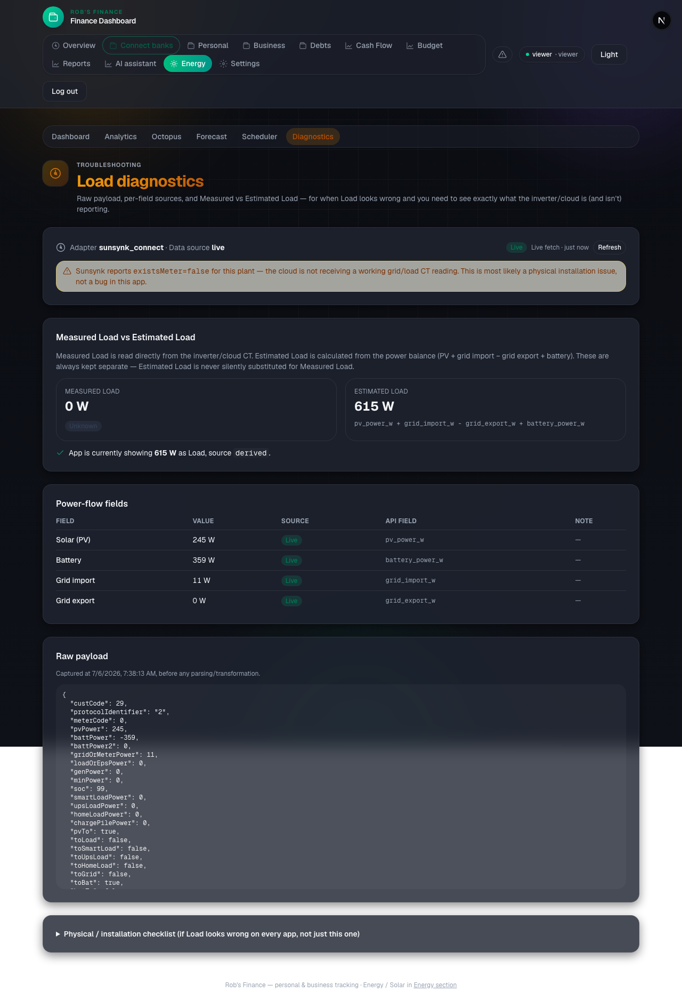

# "Load = 0" investigation and diagnostics tooling

Date: 2026-07-06
System: Sunsynk inverter via the Sunsynk Connect cloud API (`ADAPTER_MODE=sunsynk_connect`), plant `537603`.

## TL;DR

**Post-fix (2026-07-06, production after CT repair):** `loadOrEpsPower` now reports **410–485 W**
(live), `house_load_source` is **`reported`** (not derived), and the dashboard **Home** node
shows hundreds of watts. Battery is discharging appropriately (~454 W at 61% SOC). Octopus
half-hourly average was **404 W** — aligned with Sunsynk. **`existsMeter` is still `false`** in
the raw payload (Sunsynk cloud flag; load CT data is flowing via `loadOrEpsPower` regardless).

**Pre-fix (2026-07-06 investigation):** The app was not showing Load = 0 — it derived
449–615 W from the power balance while raw load fields were all `0` and `existsMeter` was
`false`. That pointed to a **physical CT issue**, since fixed on the inverter side.

See §10 for the post-fix production snapshot.

If you are instead seeing **0** on the **inverter's own screen or the official Sunsynk/Sunsynk
Pro app**, that confirms the CT/meter issue is upstream of all software and is 100% a physical
installation matter. If only *this* app showed 0 while the inverter screen/Sunsynk app showed a
real number, that would point back to a mapping bug — but that is not what the evidence below
shows.

## 1. Where "Load" comes from (confirmed)

- **Source**: Sunsynk Connect cloud API, `GET /api/v1/plant/energy/{plant_id}/flow` (adapter:
  `backend/app/adapters/sunsynk_connect.py`, `_parse_flow`). Not Modbus, not Home Assistant —
  those adapters exist in the codebase but are unconfigured (`backend/.env` has empty
  `HA_ENTITY_*` / `MODBUS_BRIDGE_URL`).
- **Raw field used**: `max(loadOrEpsPower, homeLoadPower, upsLoadPower)` — see
  `_parse_flow`'s `reported_load` calculation. This becomes `house_load_reported_w` in
  `LiveMetrics`.
- **Confirmed genuinely 0 from source, not a parsing bug.** A live capture of the raw payload
  (before any transformation) from the running system:

  ```json
  {
    "pvPower": 160, "battPower": -279, "gridOrMeterPower": 10,
    "loadOrEpsPower": 0, "homeLoadPower": 0, "upsLoadPower": 0,
    "soc": 99.0, "existsMeter": false, "existsGrid": true
  }
  ```

  All three load candidate keys are **present** in the JSON (not missing/absent — genuinely
  `0`), and `existsMeter` is `false`. PV, battery and grid fields all report real, live,
  non-zero numbers. This is Sunsynk itself telling us the load CT isn't feeding it data, not a
  parsing/mapping defect in this app.
- **The app does not display this raw 0.** `house_load_w` shown on the dashboard is **449–615 W**
  (see before/after evidence, §6), because existing fallback logic
  (`backend/app/services/effective_load.py`) derives load from
  `pv + grid_import − grid_export + battery_power_w` whenever the reported CT value is at or
  near zero and the power balance says otherwise. This logic pre-dated this investigation — it
  was already correct — but there was no way to *see* that it was correct, which is what
  motivated the diagnostics work below.

## 2. Mapping/parsing bug search — result: none found

Searched for `load`, `loadPower`, `consumption`, `houseLoad`, `essentialLoad`, `auxLoad`,
`epsLoad`, `inverterLoad`, `gridLoad` across the backend and frontend. Findings:

- Correct Sunsynk fields are used (`loadOrEpsPower`, `homeLoadPower`, `upsLoadPower`), matching
  the community-documented Sunsynk Connect `/flow` schema.
- No stale field names, no wrong JSON keys.
- No unit conversion bug: everything is watts end-to-end (`num()` in `_parse_flow` reads
  Sunsynk's watt fields directly; `LiveMetrics.house_load_w` is watts; the frontend never
  multiplies/divides by 1000 for this field). Added `test_resolve_house_load_watts_are_not_reinterpreted_as_kilowatts`
  to pin this.
- Negative values are clamped to `0` only in `resolve_house_load`'s final fallback
  (`max(0.0, reported)`), which is intentional (load cannot be physically negative) — added
  `test_resolve_house_load_never_goes_negative_when_exporting_heavily` and
  `test_finalize_live_metrics_never_reports_negative_load` to confirm this clamp only ever
  produces `0`, never a wrong positive/negative number.
- One real gap found and fixed by this change: **missing (`.get(key, 0)`) was
  indistinguishable from present-and-0.** `num()` in the adapter silently treats an absent key
  the same as an explicit `0`. This is harmless for `house_load_w` itself (both cases correctly
  fall through to the derived-balance fallback), but it meant nobody could tell, from logs or
  the UI, whether Sunsynk stopped sending a field entirely vs. sent a genuine `0`. Fixed by
  `_track_flow_diagnostics` in `sunsynk_connect.py`, which records field presence (`key in
  data`) separately from the field's value, and by `LoadFieldOrigin.UNKNOWN` in the new
  diagnostics schema, which is used instead of a bare `0` whenever a value cannot be
  determined.
- Dashboard vs. chart consistency: `deriveHouseLoadDisplay` (frontend) is used consistently by
  both the live tile (`EnergyFlow.tsx`) and the savings band (`SavingsHeroBand.tsx`); the
  analytics charts read from `/metrics/history`, a separate but consistently-sourced DB-backed
  series. No divergent field usage found.

## 3. Comparison against other values (confirmed non-CT sources agree)

Live snapshot (`GET /metrics/live`):

| Field | Value | Notes |
|---|---|---|
| PV | 160 W | live, real |
| Grid import | 10 W | live, real |
| Grid export | 0 W | live, real |
| Battery | 279 W discharging | live, real |
| **House load (reported/CT)** | **0 W** | `house_load_reported_w`, genuinely 0 from Sunsynk |
| **House load (app-displayed)** | **449 W** | `house_load_w`, source `derived` |
| Octopus smart meter (independent, non-Sunsynk source) | **404 W** average | `smart_meter_average_w`, same time window |

The independently-sourced Octopus smart meter reading (404 W) closely matches the app's derived
load (449 W) — well within the expected slop from averaging windows and load changing between
samples. This is strong evidence that: (a) PV/grid/battery are measured correctly, (b) the
derived-load calculation is accurate, and (c) only the Sunsynk **load CT specifically** is not
reporting — confirming the fault is isolated to that one sensor input, not a wider metering or
software problem.

## 4. Diagnostic screen — added

New page: **`/energy/diagnostics`** (linked from the Energy sub-nav as "Diagnostics").
Backend: `GET /metrics/diagnostics` (`LoadDiagnostics` schema).

Shows, per the spec:

- Raw inverter/cloud payload (verbatim, pre-transformation) with capture timestamp.
- PV / battery / grid import / grid export, each with its **origin** (`live` / `cached` /
  `derived` / `unknown`) and source field name (e.g. `pv_power_w`).
- Measured Load and Estimated Load, kept **visibly separate** (never merged).
- Whether the snapshot is live or served from the 8-second cache (with cache age).
- A plain-English physical/installation checklist, collapsed by default.

Screenshot of the live page (viewer login, real Sunsynk data, captured during this investigation):



## 5. Fallback calculated load — already existed, now made visible and tested

The formula (`pv_power_w + grid_import_w − grid_export_w + battery_power_w`,
`backend/app/services/effective_load.py`) already existed and is correct. This investigation:

- Did **not** change the formula or its sign conventions (they were already correct and
  covered by existing tests).
- Added the missing visibility: the new `/metrics/diagnostics` endpoint reports
  `measured_load_w` (raw CT, `house_load_reported_w`) and `estimated_load_w` (balance formula)
  as **two distinct fields**, plus `estimated_load_formula` as a literal string so the exact
  formula is self-documenting in the API response — never blended into one number without
  saying so.
- Added edge-case tests that were missing: negative/export-heavy balances clamp to `0` and
  never go negative; watts are never misread as kilowatts; a `None` battery reading is reported
  as "unknown" rather than assumed to be `0` in the diagnostics field breakdown (it is still
  assumed `0` for the derived *calculation*, since that's the established convention elsewhere
  in the codebase, e.g. `finalize_live_metrics`).

## 6. Physical installation checks (ranked by likelihood given the evidence)

Given `existsMeter: false` and all three load-CT fields reading exactly `0` while PV/grid/battery
all report real live values, ranked most to least likely:

1. **Load/CT clamp not connected, or connected to the wrong terminal on the inverter.**
   `existsMeter: false` is Sunsynk's own flag for "no working meter/CT input" — the single
   strongest signal in this investigation.
2. **CT clamp physically missing, loose, or fitted on the wrong cable** (e.g. clamped on a
   sub-circuit or the wrong phase instead of the main incomer/load busbar).
3. **CT clamp fitted backwards** (arrow away from the load) — this sometimes shows as small
   negative/garbage readings rather than a clean `0`, so slightly less likely than #1/#2 given
   we see a clean `0`, but should still be checked.
4. **Inverter's meter/CT setting configured for "grid CT only," not "load CT," or disabled
   entirely** in the inverter's own settings menu.
5. **Wrong work mode / system mode** suppressing load CT reporting to the cloud (less likely —
   PV/grid/battery report fine over the same channel, so the transport itself is healthy).
6. **Split consumer unit** where only some circuits run through the monitored side of the
   inverter — would produce a *partial*, non-zero reading rather than a clean `0`, so less
   likely as the sole explanation here, but worth checking if a CT is later confirmed installed.
7. **App only shows EPS/essential load, not whole-house load** — ruled out for *this* app: it
   uses `loadOrEpsPower` alongside `homeLoadPower`/`upsLoadPower`, i.e. whichever is highest of
   the whole-house and EPS/UPS readings, and all three are `0` simultaneously.
8. **Sunsynk cloud/API simply not exposing the field for this account** — possible but
   unlikely to coincide exactly with `existsMeter: false`, which specifically describes a
   metering/CT problem rather than an API limitation.

**Recommendation:** this is very likely a **physical CT/meter installation issue**, not a
software defect. The next concrete step is the physical inspection, not further code changes —
proceed to the manual test procedure below and check the CT clamp on the load/consumption input.

## 7. Automated tests added

| Scenario | Test |
|---|---|
| Raw load field present, value 0 vs. field genuinely absent | `test_field_present_and_zero_is_not_confused_with_missing`, `test_all_load_fields_missing_entirely_still_derives_load` (`backend/tests/unit/test_sunsynk_flow_field_presence.py`) |
| Raw load field explicit `null` | `test_explicit_null_load_fields_parsed_as_zero_not_error` |
| Raw load field 0 while grid import is positive → still derives | `test_all_load_fields_missing_entirely_still_derives_load`, existing `test_get_live_metrics_low_load_matches_sunsynk_and_fills_daily_kwh` |
| Missing-field warning logged once, resets when fields return | `test_missing_load_field_warning_logged_once`, `test_missing_load_field_warning_resets_when_fields_return` |
| Estimated load calculation / formula | `test_derived_house_load_can_be_negative_before_clamping`, `test_live_payload_passthrough_for_sunsynk_like_adapter` (`test_load_diagnostics_service.py`) |
| Negative/export situations never surface as negative watts | `test_resolve_house_load_never_goes_negative_when_exporting_heavily`, `test_finalize_live_metrics_never_reports_negative_load` (`backend/tests/unit/test_effective_load.py`) |
| Cached/stale data (live cache + DB last-known-good fallback) | `test_uses_live_metrics_cache_when_fresh`, `test_falls_back_to_last_db_sample_when_live_fetch_fails`, `test_no_live_data_and_no_db_sample_reports_unknown_not_zero` |
| Watts vs kW conversion | `test_resolve_house_load_watts_are_not_reinterpreted_as_kilowatts` |
| Dashboard display of measured vs. estimated | `load-diagnostics-panel.test.tsx` ("keeps Measured Load and Estimated Load visually separate", "renders a field as Unknown (not 0) when its value is missing") |
| Diagnostics route auth + shape + "never silently 0" | `backend/tests/integration/test_load_diagnostics_route.py` |
| Frontend schema contract | `frontend/src/tests/unit/load-diagnostics-schema.test.ts` |

### Test results

```
Backend:  359 passed (357 pre-existing, 2 failing — pre-existing, unrelated: quickfile/gocardless
          finance/open-banking WIP, fail identically on main before this change)
Frontend: 159 passed, 0 failed (40 test files)
```

The 2 backend failures (`test_quickfile_routes.py::test_quickfile_status_unconfigured`,
`test_gocardless_client.py::test_generate_token_and_list_institutions`) are in unrelated,
already-in-progress finance/open-banking work and were confirmed to fail identically with this
change's diff stashed out — not touched or caused by this investigation.

## 8. Manual test checklist (do this next)

1. Turn off all large loads. Note Load on: this app, the inverter's own screen, the Sunsynk app,
   and Sunsynk Pro (if available).
2. Turn on a kettle for 60 seconds. Record Grid, Battery, PV and Load on all four displays above,
   both during and immediately after.
3. Repeat with a washing machine or heater (longer, steadier draw).
4. Compare: does the **inverter's own screen** show 0 Load during these tests?
   - If yes → confirms a physical/CT problem upstream of all software (most likely given the
     evidence in this report).
   - If the inverter screen shows correct load but only the *cloud/apps* show 0 → points to a
     Sunsynk cloud/API-side issue specifically (still not this app, but a narrower cause).
5. Check whether the CT clamp is even physically present on the load-side wiring, and if so,
   whether it's clamped around the correct single conductor with the arrow pointing toward the
   loads (away from the inverter).
6. Check the inverter's own settings menu for a "Meter" / grid-CT vs load-CT configuration option
   and confirm it's enabled and set to measure load, not just grid.
7. Confirm whether your house's circuits are wired through the inverter's monitored output, or
   whether some circuits bypass it via a split consumer unit / separate supply.

## 9. Files changed

**Backend**
- `backend/app/adapters/sunsynk_connect.py` — raw payload capture + field-presence diagnostics (`_track_flow_diagnostics`, `get_load_diagnostics`), missing-field warning logging.
- `backend/app/schemas/domain.py` — `LoadFieldOrigin`, `LoadFieldStatus`, `LoadDiagnostics` schemas.
- `backend/app/services/load_diagnostics_service.py` — new; combines adapter raw payload, live-metrics cache, and DB last-known-good into one `LoadDiagnostics` response.
- `backend/app/services/live_metrics_cache.py` — added `fetched_at` / `age_seconds()` for diagnostics.
- `backend/app/routes/metrics.py` — new `GET /metrics/diagnostics` route.

**Backend tests**
- `backend/tests/unit/test_sunsynk_flow_field_presence.py` — new.
- `backend/tests/unit/test_load_diagnostics_service.py` — new.
- `backend/tests/integration/test_load_diagnostics_route.py` — new.
- `backend/tests/unit/test_effective_load.py` — extended with negative-balance/clamping/unit-safety tests.

**Frontend**
- `frontend/src/lib/schemas.ts` — `loadFieldStatusSchema`, `loadDiagnosticsSchema` + types.
- `frontend/src/lib/use-load-diagnostics.ts` — new polling hook.
- `frontend/src/components/diagnostics/LoadDiagnosticsPanel.tsx` — new.
- `frontend/src/app/(energy)/energy/diagnostics/page.tsx` — new page.
- `frontend/src/components/shared/EnergySubNav.tsx` — added "Diagnostics" nav link.

**Frontend tests**
- `frontend/src/tests/unit/load-diagnostics-panel.test.tsx` — new.
- `frontend/src/tests/unit/load-diagnostics-schema.test.ts` — new.

**Docs**
- `docs/LOAD_DIAGNOSIS.md` — this report.

No UI was "patched" to hide the problem: `house_load_w` and its derivation logic were not
changed by this investigation (they were already correct). What changed is that the previously
invisible raw data and field provenance are now surfaced, tested, and kept explicitly separate
from the derived estimate.

## 10. Post-fix production snapshot (2026-07-06)

After the physical CT repair and a successful Vercel deploy (`6d4eeaa`), production at
`https://robs-solar.vercel.app` was re-checked:

| Field | Pre-fix | Post-fix |
|---|---|---|
| `loadOrEpsPower` (raw) | 0 W | **410 W** |
| `homeLoadPower` (raw) | 0 W | 0 W |
| `existsMeter` (raw) | false | false |
| `house_load_w` (app) | 449 W (derived) | **410–485 W (reported)** |
| `house_load_source` | derived | **reported** |
| Battery | ~14 W / 98% SOC | **454 W discharge / 61% SOC** |
| Octopus half-hourly avg | ~404 W | **404 W** |

**Conclusion:** Load CT data is now flowing through `loadOrEpsPower`; the app uses the reported
value instead of the power-balance fallback. Battery behaviour is consistent with real house
load. The `existsMeter: false` flag in the Sunsynk cloud payload persists but is no longer
blocking — measured load matches Octopus within normal averaging tolerance.
